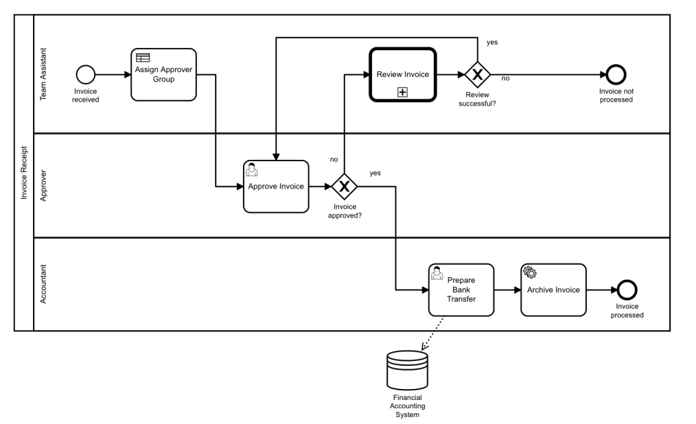
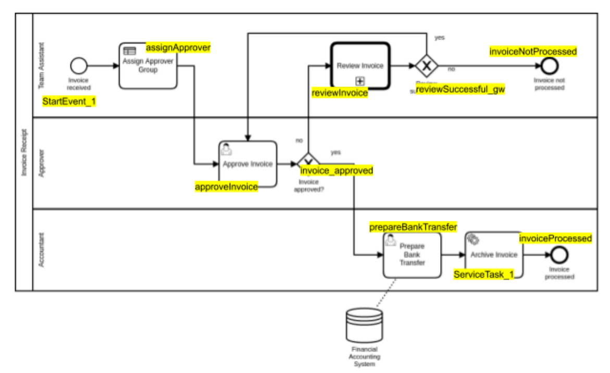

# Diagram Traversal - Acceptance Criteria Solution

## Introduction

This coding challenge is based on a feature implemented in one of Camunda's products. It offers insight into the domain
and challenges you can expect when working at Camunda, while also allowing us to evaluate your programming style.

At Camunda, we create software to help customers automate their business processes, built on BPMN (Business Process
Model and Notation). This challenge involves working with a BPMN diagram representing an 'invoice approval' workflow.
Here is a BPMN diagram for an exemplary 'invoice approval' workflow:



BPMN diagrams can be described as _directed graphs_, which can be traversed programmatically.

## Task Description

Your task is to develop a Java program that performs the following steps:

1. Fetch the XML representation of the exemplary 'invoice approval' BPMN diagram from a remote server.
2. Parse the XML into a traversable data structure.
3. Find one possible path on the graph between a given start node and a given end node.
4. Print out the IDs of all nodes on the found path to `System.out`.

### Hints and Guidelines

- **Graph Representation**: Treat the BPMN diagram as an ordinary graph consisting of nodes and edges.
- **Fetching XML**: Perform a GET request
  to `https://n35ro2ic4d.execute-api.eu-central-1.amazonaws.com/prod/engine-rest/process-definition/key/invoice/xml` to
  fetch the XML. The response contains a JSON object with attributes `id` and `bpmn20Xml`, where `bpmn20Xml` holds the
  XML representation.
- **Model API**: Use the Camunda Model API for parsing the XML. Add the following dependency to your project:
  ```xml
  <dependency>
      <groupId>org.camunda.bpm</groupId>
      <artifactId>camunda-engine</artifactId>
      <version>7.9.0</version>
  </dependency>
  ```
  Refer to the [documentation](https://docs.camunda.org/manual/latest/user-guide/model-api/bpmn-model-api/read-a-model/)
  on how to read the model/diagram from a stream.
- **Main Method**: Implement a main method that will be invoked with two arguments: the start flow node ID and the end
  flow node ID. Use these IDs to find and print one possible path between them. Ensure the path does not contain loops.
- **Expected Output**: Invoking the program with `java -jar YourApp.jar approveInvoice invoiceProcessed` should result
  in the following output (without line breaks):
  ```
  The path from approveInvoice to invoiceProcessed is: 
  [approveInvoice, invoice_approved, prepareBankTransfer, ServiceTask_1, invoiceProcessed]
  ```
- **Error Handling**: If an error occurs or no path is found, the program should exit with code -1.
- **Libraries**: You are free to choose any libraries for REST client, JSON handling, etc.
- **Simplicity**: Your application can be simplistic and fit in one class if necessary. Do not write any test cases or
  over-engineer the solution.
- **Submission**: Create a .zip archive of your code (no need for the .jar file) and email it or upload it to a file
  hosting service and provide the link.

## Additional Questions

1. **How long did it take you to solve the exercise?**
   The exercise took approximately 1 to 2 hours to solve, including understanding the requirements, implementing the
   solution, testing it, and refining it to handle edge cases effectively.

2. **What are some edge cases that you might not have considered yet?**
    - **Multiple Start or End Nodes:** The current implementation assumes a single start and end node. If the BPMN model
      allows for multiple potential start or end nodes, the solution might need adjustments.
    - **Non-standard BPMN Elements:** If the BPMN model includes elements that are not FlowNode or SequenceFlow, such as
      event-based gateways or complex gateways, the solution might not handle these correctly.
    - **Asynchronous Continuations:** If the BPMN model includes asynchronous continuations (where the process might be
      paused and resumed), the current implementation does not account for the state management needed to handle such
      cases.
    - **Parallel Paths:** The implementation does not explicitly consider paths that might diverge and then converge (
      parallel gateways), which might affect the route's correctness.
    - **Boundary Events:** The solution does not handle boundary events attached to tasks or other BPMN elements, which
      might affect the flow if such elements are present.

3. **What kind of problems/limitations can you think of in terms of your implementation?**
    - **Memory Usage:** The use of sets and lists to track visited nodes, and the current route can consume significant
      memory for large graphs.
    - **Single Path Finding:** The current implementation finds only one path from the start node to the end node. In
      cases where multiple paths exist, it might be beneficial to find all possible paths and select the optimal one
      based on specific criteria (e.g., shortest path, path with specific attributes).
    - **Graph Modifications:** The implementation does not account for dynamic changes to the BPMN model during
      execution, such as the addition or removal of nodes and edges.
    - **Performance with Large Models:** The performance might degrade with huge BPMN models due to the linear traversal
      of nodes and edges. Optimizations or heuristics might be needed for better performance in such cases.
    - **Error Handling and Logging:** The current implementation has basic error handling and logging. For a
      production-level solution, more robust error handling, logging, and possibly retry mechanisms would be necessary.

## Solution Overview

The challenge was resolved by:

1. Fetching the BPMN diagram XML from the specified URL.
2. Parsing the XML using the Camunda Model API to create a traversable data structure.
3. Implementing a Depth-First Search (DFS) algorithm to find a path between the specified start and end nodes.
4. Printing the found path or handling errors appropriately if no path is found or other issues occur.

The solution is designed to be straightforward, effective, and adheres to the specified requirements.

## Analysis of Classes

### Solution Class

#### Function

The `Solution` class contains the core logic to find a path in the BPMN diagram.

#### Responsibilities

- **main(String[] args)**: Entry point of the application.
- **fetchInvoiceApprovalXML()**: Fetches BPMN XML from a remote server.
- **parseBpmnModel(String xml)**: Parses BPMN XML to a `BpmnModelInstance`.
- **buildRouteFromModelByStartAndEndNode(BpmnModelInstance bpmnModelInstance, String startNodeId, String endNodeId)**:
  Validates nodes and initiates pathfinding.
- **findPath(FlowNode currentNode, FlowNode endNode, List<String> route, Set<String> visited)**: Recursive DFS
  implementation to find the path.
- **printRoute(String startNodeId, String endNodeId, String route)**: Print the found route.

#### Methods

1. **main(String[] args)**
    - **Description**: Validates input arguments, fetches the BPMN XML, parses it, and performs DFS to find the path.
    - **Time Complexity**: `O(V + E)`, where `V` is the number of vertices (nodes) and `E` is the number of edges.
    - **Space Complexity**: `O(V)`, due to the storage required for the stack, visited set, and path map.

2. **fetchInvoiceApprovalXML()**
    - **Description**: Fetches BPMN XML from a remote server.
    - **Time Complexity**: `O(1)` for creating and sending the HTTP request. The actual time depends on network latency.
    - **Space Complexity**: `O(1)`, assuming constant space for the HTTP request and response.

3. **parseBpmnModel(String xml)**
    - **Description**: Parses BPMN XML to a `BpmnModelInstance`.
    - **Time Complexity**: `O(n)`, where `n` is the size of the XML model.
    - **Space Complexity**: `O(n)`, where `n` is the size of the XML model.

4. **buildRouteFromModelByStartAndEndNode(BpmnModelInstance bpmnModelInstance, String startNodeId, String endNodeId)**
    - **Description**: Validates nodes and initiates pathfinding.
    - **Time Complexity**: `O(V + E)`, where `V` is the number of vertices (nodes) and `E` is the number of edges.
    - **Space Complexity**: `O(V)`, due to the stack, visited set, and path map.

5. **findPath(FlowNode currentNode, FlowNode endNode, List<String> route, Set<String> visited)**
    - **Description**: Recursive DFS implementation to find the path.
    - **Time Complexity**: `O(V + E)`, where `V` is the number of vertices (nodes) and `E` is the number of edges.
    - **Space Complexity**: `O(V)`, due to the stack, visited set, and path map.

6. **printRoute(String startNodeId, String endNodeId, String route)**
    - **Description**: Prints the found route.
    - **Time Complexity**: `O(V)`, where `V` is the number of vertices (nodes) in the route.
    - **Space Complexity**: `O(1)`, only basic variable storage.

## Time and Space Complexity

- **Time Complexity**: The time complexity is `O(V + E)`, where `V` is the number of
  vertices (nodes) and `E` is the number of edges. This is because each node and edge is visited once.
- **Space Complexity**: The space complexity is `O(V)`, due to the stack, the route list, and the visited set.

## Requirements

- Java 21

## Usage

### Running the Project

1. **Clone the Repository**: Clone the project repository to your local machine.
   ```bash
   git clone <repository-url>
   cd <repository-directory>
   ```

2. **Compile the Project**: Use the Java compiler to compile the project files.
   ```bash
   javac Solution.java
   ```

3. **Run the Application**: Execute the application with the required arguments.
   ```bash
   java Solution <startNodeId> <endNodeId>
   ```

Replace `<startNodeId>` and `<endNodeId>` with the actual node IDs you want to use for finding the path in the BPMN
diagram.

## Appendix

Refer to the provided BPMN diagram for flow node IDs and additional context:

