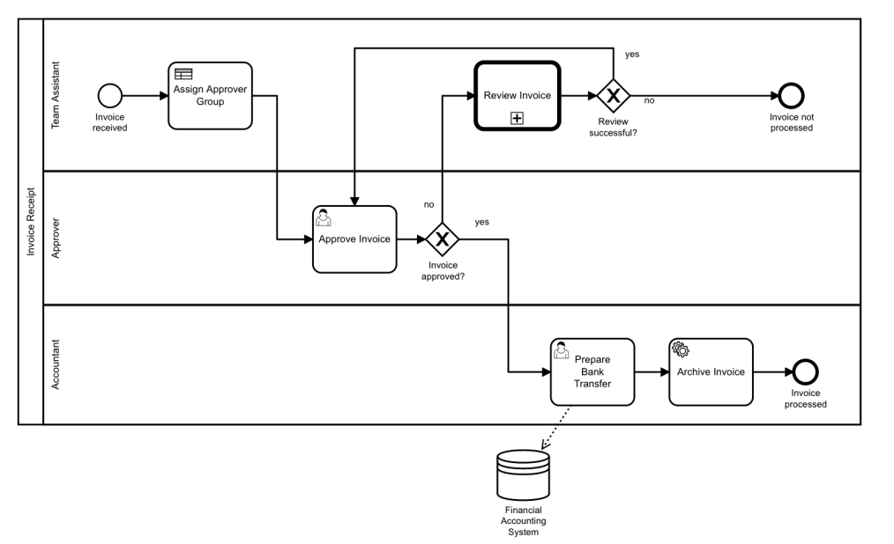
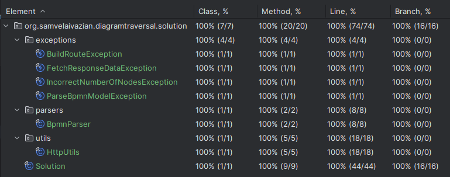
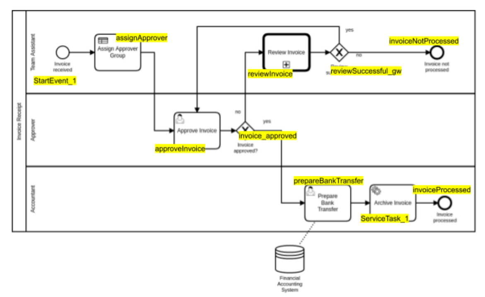

# Diagram Traversal - Clean Design Solution

## Introduction

This coding challenge is based on a feature implemented in one of Camunda's products. It offers insight into the domain
and challenges you can expect when working at Camunda, while also allowing us to evaluate your programming style.

At Camunda, we create software to help customers automate their business processes, built on BPMN (Business Process
Model and Notation). This challenge involves working with a BPMN diagram representing an 'invoice approval' workflow.
Here is a BPMN diagram for an exemplary 'invoice approval' workflow:



BPMN diagrams can be described as _directed graphs_, which can be traversed programmatically.

## Task Description

Your task is to develop a Java program that performs the following steps:

1. Fetch the XML representation of the exemplary 'invoice approval' BPMN diagram from a remote server.
2. Parse the XML into a traversable data structure.
3. Find one possible path on the graph between a given start node and a given end node.
4. Print out the IDs of all nodes on the found path to `System.out`.

### Hints and Guidelines

- **Graph Representation**: Treat the BPMN diagram as an ordinary graph consisting of nodes and edges.
- **Fetching XML**: Perform a GET request
  to `https://n35ro2ic4d.execute-api.eu-central-1.amazonaws.com/prod/engine-rest/process-definition/key/invoice/xml` to
  fetch the XML. The response contains a JSON object with attributes `id` and `bpmn20Xml`, where `bpmn20Xml` holds the
  XML representation.
- **Model API**: Use the Camunda Model API for parsing the XML. Add the following dependency to your project:
  ```xml
  <dependency>
      <groupId>org.camunda.bpm</groupId>
      <artifactId>camunda-engine</artifactId>
      <version>7.9.0</version>
  </dependency>
  ```
  Refer to the [documentation](https://docs.camunda.org/manual/latest/user-guide/model-api/bpmn-model-api/read-a-model/)
  on how to read the model/diagram from a stream.
- **Main Method**: Implement a main method that will be invoked with two arguments: the start flow node ID and the end
  flow node ID. Use these IDs to find and print one possible path between them. Ensure the path does not contain loops.
- **Expected Output**: Invoking the program with `java -jar YourApp.jar approveInvoice invoiceProcessed` should result
  in the following output (without line breaks):
  ```
  The path from approveInvoice to invoiceProcessed is: 
  [approveInvoice, invoice_approved, prepareBankTransfer, ServiceTask_1, invoiceProcessed]
  ```
- **Error Handling**: If an error occurs or no path is found, the program should exit with code -1.
    - *Implementation Note*: In this implementation, the program throws custom exceptions such as `BuildRouteException`
      or `IncorrectNumberOfNodesException` to handle various error conditions. The program does not exit with code -1
      but instead uses these exceptions to signal errors.
- **Libraries**: You are free to choose any libraries for REST client, JSON handling, etc.
    - *Implementation Note*: This implementation uses standard Java libraries for HTTP operations and JSON handling.
      Specifically, it uses `HttpClient` for HTTP requests and the Camunda Model API for BPMN parsing.
- **Simplicity**: Your application can be simplistic and fit in one class if necessary. Do not write any test cases or
  over-engineer the solution.
    - *Implementation Note*: This implementation follows a clean design approach, which involves multiple classes, each
      with a specific responsibility. While this adds some complexity, it greatly improves maintainability, readability,
      and testability.

**Additional Implementation Notes**:

- **Testing**: Comprehensive test cases have been added to ensure the robustness and correctness of the solution. This
  includes unit tests for individual methods and integration tests for the overall functionality.
- **Error Handling and Logging**: Basic error handling is implemented using custom exceptions. More advanced logging and
  error handling mechanisms could be added for a production-level solution.
- **Performance**: The implementation does not include advanced performance optimizations. For huge BPMN diagrams,
  additional optimizations might be necessary to ensure scalability and efficiency.

## Additional Questions

1. **How long did it take you to solve the exercise?**
    - The exercise took approximately 6 to 8 hours to solve, including understanding the requirements, designing the
      clean architecture, implementing the solution, writing comprehensive tests, and refining it to handle edge cases
      effectively.

2. **What are some edge cases that you might not have considered yet?**
    - **Multiple Start or End Nodes**: The current implementation assumes a single start and end node. If the BPMN model
      allows for multiple potential start or end nodes, the solution might need adjustments.
    - **Non-standard BPMN Elements**: If the BPMN model includes elements that are not FlowNode or SequenceFlow, such as
      event-based gateways or complex gateways, the solution might not handle these correctly.
    - **Asynchronous Continuations**: If the BPMN model includes asynchronous continuations (where the process might be
      paused and resumed), the current implementation does not account for the state management needed to handle such
      cases.
    - **Parallel Paths**: The implementation does not explicitly consider paths that might diverge and then converge
      (parallel gateways), which might affect the route's correctness.
    - **Boundary Events**: The solution does not handle boundary events attached to tasks or other BPMN elements, which
      might affect the flow if such elements are present.

3. **What kind of problems/limitations can you think of in terms of your implementation?**
    - **Memory Usage**: The use of sets and lists to track visited nodes and the current route can consume significant
      memory for large graphs.
    - **Single Path Finding**: The current implementation finds only one path from the start node to the end node. In
      cases where multiple paths exist, it might be beneficial to find all possible paths and select the optimal one
      based on specific criteria (e.g., the shortest path, path with specific attributes).
    - **Graph Modifications**: The implementation does not account for dynamic changes to the BPMN model during
      execution, such as the addition or removal of nodes and edges.
    - **Performance with Large Models**: The performance might degrade with huge BPMN models due to the linear traversal
      of nodes and edges. Optimizations or heuristics might be needed for better performance in such cases.
    - **Error Handling and Logging**: The current implementation has basic error handling and logging. For a
      production-level solution, more robust error handling, logging, and possibly retry mechanisms would be necessary.

## Solution Overview

The challenge was resolved by:

1. Fetching the BPMN diagram XML from the specified URL.
2. Parsing the XML using the Camunda Model API to create a traversable data structure.
3. Implementing a Depth-First Search (DFS) algorithm to find a path between the specified start and end nodes.
4. Printing the found path or handling errors appropriately if no path is found or other issues occur.

The solution follows clean design principles, ensuring modularity, maintainability, and testability. The implementation
involves several key classes, each with a specific responsibility:

1. **Main Class**: Entry point for the application.
2. **Solution Class**: Core logic for processing and traversing the BPMN model.
3. **BpmnParser Class**: Responsible for parsing the BPMN XML.
4. **HttpUtils Class**: Utility class for HTTP operations.
5. **Exception Classes**: Custom exceptions for error handling.

### Analysis of Classes

1. **Main Class**:
    - **Function**: Entry point of the application.
    - **Responsibilities**: Initializes `BpmnParser` and `Solution` objects and invokes the `run` method of `Solution`.

2. **Solution Class**:
    - **Function**: Core logic to find a path in the BPMN diagram.
    - **Responsibilities**: Validates input arguments, fetches the BPMN XML, parses it, and performs iterative DFS to
      find the path.
    - **Methods**:
        - `run(String[] nodeIds)`: Main execution method that ties together validation, fetching, parsing, and
          pathfinding.
            - **Time Complexity**: `O(V + E)`, where `V` is the number of vertices (nodes) and `E` is the number of
              edges.
            - **Space Complexity**: `O(V)`, due to the storage required for the stack, visited set, and path map.
        - `validateNumberOfProvidedNodes(String[] nodeIds)`: Ensures exactly two node IDs are provided.
            - **Time Complexity**: `O(1)`, constant time to check the number of node IDs.
            - **Space Complexity**: `O(1)`, no additional space required.
        - `fetchInvoiceApprovalXML()`: Fetches BPMN XML from a remote server.
            - **Time Complexity**: `O(1)` for creating and sending the HTTP request. The actual time depends on network
              latency.
            - **Space Complexity**: `O(1)`, assuming constant space for the HTTP request and response.
        - `buildRouteFromModelByStartAndEndNode(BpmnModelInstance bpmnModelInstance, String startNodeId,
          String endNodeId)`: Validates nodes and initiates pathfinding.
            - **Time Complexity**: `O(V + E)`, where `V` is the number of vertices (nodes) and `E` is the number of
              edges.
            - **Space Complexity**: `O(V)`, due to the stack, visited set, and path map.
        - `validateIfModelNodesExist(String startNodeId, String endNodeId, FlowNode startNode, FlowNode endNode)`:
          Ensures nodes exist in the model.
            - **Time Complexity**: `O(1)`, constant time to check if nodes are null.
            - **Space Complexity**: `O(1)`, no additional space required.
        - `buildRoute(FlowNode startNode, FlowNode endNode)`: Iterative DFS implementation to find the path.
            - **Time Complexity**: `O(V + E)`, where `V` is the number of vertices (nodes) and `E` is the number of
              edges.
            - **Space Complexity**: `O(V)`, due to the stack, visited set, and path map.
        - `reconstructPath(FlowNode endNode, Map<FlowNode, FlowNode> pathMap)`: Constructs the path from end node to
          start node using the path map.
            - **Time Complexity**: `O(V)`, where `V` is the number of vertices (nodes), because we potentially visit
              each node once.
            - **Space Complexity**: `O(V)`, due to the route list which stores up to `V` nodes.
        - `printRoute(String startNodeId, String endNodeId, List<String> route)`: Prints the found route.
            - **Time Complexity**: `O(V)`, where `V` is the number of vertices (nodes) in the route.
            - **Space Complexity**: `O(1)`, only basic variable storage.

3. **BpmnParser Class**:
    - **Function**: Parsing BPMN XML.
    - **Responsibilities**: Converts JSON responses to BPMN XML and parses BPMN XML to a `BpmnModelInstance`.
    - **Methods**:
        - `getBpmn20XmlFromJson(String jsonResponse)`: Extracts BPMN XML from JSON response.
            - **Time Complexity**: `O(1)`, constant time to extract the XML from JSON.
            - **Space Complexity**: `O(n)`, where `n` is the size of the JSON response.
        - `getBpmnModelFromXml(String xmlBpmnModel)`: Parses BPMN XML to a `BpmnModelInstance`.
            - **Time Complexity**: `O(n)`, where `n` is the size of the XML model.
            - **Space Complexity**: `O(n)`, where `n` is the size of the XML model.

4. **HttpUtils Class**:
    - **Function**: HTTP operations.
    - **Responsibilities**: Fetches response data from a given URL.
    - **Methods**:
        - `fetchResponse(String url)`: Sends a GET request to the URL and returns the response body.
            - **Time Complexity**: `O(1)` for creating and sending the HTTP request. The actual time depends on network
              latency.
            - **Space Complexity**: `O(1)`, assuming constant space for the HTTP request and response.

5. **Custom Exception Classes**:
    - **BuildRouteException**: Thrown when no path is found.
    - **IncorrectNumberOfNodesException**: Thrown when an incorrect number of node IDs are provided.
    - **FetchResponseDataException**: Thrown when there is an error in fetching response data.
    - **ParseBpmnModelException**: Thrown when parsing BPMN XML fails.

## Time and Space Complexity

- **Time Complexity**: The time complexity of the solution is `O(V + E)`, where `V` is the number of vertices (nodes)
  and `E` is the number of edges in the BPMN diagram. This is because the algorithm performs a depth-first search (DFS)
  which visits each node and edge exactly once.
- **Space Complexity**: The space complexity is `O(V)`, where `V` is the number of vertices (nodes). This is due to the
  storage required for the stack used in the iterative DFS, the set to keep track of visited nodes, and the map to
  reconstruct the path.

## Testing

### Explanation

The project includes comprehensive test cases to ensure the correctness and robustness of the solution. The tests cover
various scenarios, including valid inputs, invalid inputs, and edge cases.

### Test Classes

- **MainTest**: Validates the main method's behavior, including argument handling and invocation of the `Solution`
  class. (Note: The `Main` class is not directly tested as it serves as an entry point.)
- **SolutionTest**: Tests the core logic in the `Solution` class, including pathfinding and error handling.
- **BpmnParserTest**: Validates the parsing logic for converting JSON responses to BPMN XML and parsing BPMN XML to
  a `BpmnModelInstance`.
- **HttpUtilsTest**: Tests the HTTP utility methods for fetching data from URLs.

### Running Tests

To run the tests and see the assertion results, use the following command:

```bash
mvn test
```

Ensure that you have Maven installed and properly configured to execute the tests.

### Test Coverage

All test cases pass successfully, and the code coverage is 100%, as shown in the screenshot below:



**Note**: The `Main` class is not tested because it serves as an entry point and its primary responsibility is to
initiate the program execution.

## Requirements

- Java 21
- Maven (for building and running tests)

## Usage

### Running the Project

1. **Clone the Repository**: Clone the project repository to your local machine.
   ```bash
   git clone <repository-url>
   cd <repository-directory>
   ```

2. **Build the Project**: Use Maven to build the project and compile the Java files.
   ```bash
   mvn clean install
   ```

3. **Run the Application**: Execute the application with the required arguments.
   ```bash
   java -jar target/your-app.jar <startNodeId> <endNodeId>
   ```

Replace `<startNodeId>` and `<endNodeId>` with the actual node IDs you want to use for finding the path in the BPMN
diagram.

## Appendix

Refer to the provided BPMN diagram for flow node IDs and additional context:

